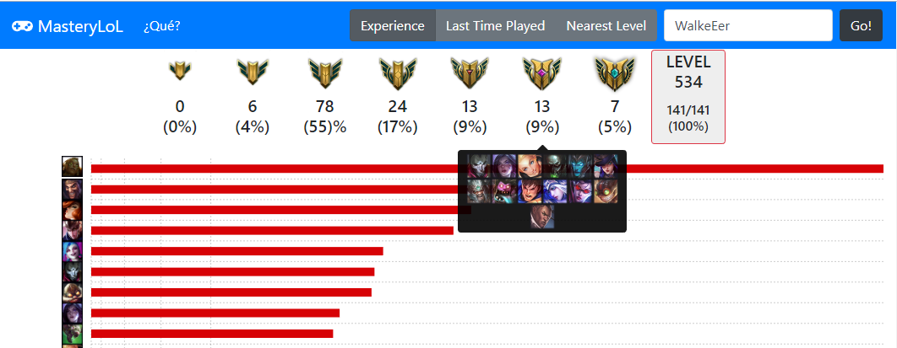

# Mastery Lol

A simple page to obtain Mastery Champion points, given a summoner name account.

You need to add summoner name and press "Go" button.

At this moment, api key can not work properly...

## Requirements
To obtain ApiToken you need a summoner account from [League of legends](http://euw.leagueoflegends.com/es) and you must sign up at [Riot Developer](https://developer.riotgames.com/).

You can see the current project status [here](https://rgraciama.github.io/MasteryLOL/)

